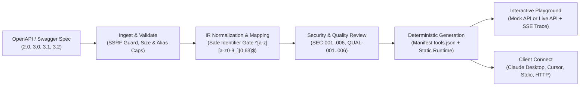

# MCP Forge

[](https://github.com/your-org/mcp-forge/actions)
[](https://modelcontextprotocol.io/specification/2026-07-28)
[](https://python.org)
[](https://nextjs.org)
[](LICENSE)

**Turn any OpenAPI or Swagger specification into a ready-to-run Model Context Protocol (MCP) server, with an interactive testing Playground and real-time protocol trace.**

Self-hosted, deterministic, local-first, and secure by design. Both the Next.js web application and the Typer CLI (`forge`) share a single core engine.

---

## 1. How It Works

MCP Forge strictly decouples dynamic specification metadata from executable server code. Rather than generating arbitrary Python source code from user-supplied specification text, Forge outputs a deterministic, schema-validated `tools.json` manifest paired with a pre-audited, fixed static runtime library.



---

## 2. 5-Minute Quick Start

### Prerequisites
- Python 3.13+ with [`uv`](https://github.com/astral-sh/uv)
- Node.js 22+ with `pnpm`

### Start the Local Application
```bash
# Clone the repository
git clone https://github.com/your-org/mcp-forge.git
cd mcp-forge

# Run backend and frontend simultaneously with hot reload
make dev
```
1. Open your browser to **`http://localhost:3000`**.
2. Click on the bundled **Bookshop API** sample strip.
3. Click **Generate MCP Server**.
4. Jump into the **Playground**, choose **Mock API (Safe)**, click **Start Session**, select `search_books`, enter arguments, and run the tool to view the live JSON-RPC protocol trace!

---

## 3. Command Line Interface (`forge`)

MCP Forge includes a command line interface for local developers and CI/CD automation pipelines.

```bash
# Install CLI via uv
cd backend
uv sync

# Validate an OpenAPI / Swagger file
uv run forge check samples/bookshop.openapi.yaml

# Run security and quality rules review
uv run forge review samples/bookshop.openapi.yaml

# Generate an MCP server project with safe defaults (read-only tools enabled)
uv run forge generate samples/bookshop.openapi.yaml -o ./out/bookshop-server

# Generate with JSON summary for CI pipelines
uv run forge generate samples/bookshop.openapi.yaml -o ./out --json
```

### Exit Codes
- `0`: Success / valid specification / review passed without blocking findings.
- `1`: Invalid specification / blocking security finding.
- `2`: Command usage error or missing required flags.

---

## 4. Configuration Reference

MCP Forge is configured via environment variables or a `.env` file:

| Variable | Default | Mode | Description |
|---|---|---|---|
| `FORGE_MODE` | `local` | `local` / `exposed` | Deployment mode. `local` binds to loopback without authentication. `exposed` requires an access token. |
| `FORGE_ACCESS_TOKEN` | *None* | Required in `exposed` | Secret bearer/session token. Forge refuses to start in exposed mode without this. |
| `FORGE_DATA_DIR` | `./data` | All | Directory for SQLite database (`forge.db`) and build output directories. |
| `HOST` | `127.0.0.1` | Local | Host binding for FastAPI backend. |
| `PORT` | `8000` | Local | Port for FastAPI backend. |
| `ALLOW_PRIVATE_TARGETS` | `false` | All | When `false`, outbound calls to RFC1918 / loopback / cloud metadata IPs are strictly blocked. |
| `PLAYGROUND_ENABLED` | `true` | All | Controls whether interactive Playground execution is enabled. |
| `PLAYGROUND_MAX_SESSIONS` | `3` | All | Concurrency limit for active in-process playground sandboxes. |
| `PLAYGROUND_IDLE_TIMEOUT_S` | `300` | All | Idle session timeout before automatic process cleanup. |

---

## 5. Security Architecture

MCP Forge enforces 12 foundational security guarantees across parsing, mapping, and runtime:

1. **Hostile-Name Fuzz Gate:** User spec strings never appear in Python source files; only in `tools.json`. Tool names must match `^[a-z][a-z0-9_]{0,63}$`.
2. **AST Security Scanner:** Generated servers are scanned with Python AST inspection to block any dynamic execution primitives (`eval`, `exec`, `compile`, `__import__`, `subprocess`, `os.system`).
3. **Safe Defaults:** Read-only operations (`GET`) are enabled by default; mutating (`POST`, `PUT`) and destructive (`DELETE`) operations are strictly disabled until explicitly enabled by a human user.
4. **SSRF Guard with Redirect Re-Validation:** Outbound spec fetching and live API calls resolve IP addresses before connecting, rejecting loopback, RFC1918 private subnets, carrier-grade NAT, and cloud metadata endpoints (`169.254.169.254`). Redirect chains are inspected at every hop.
5. **YAML & JSON Resource Caps:** Streaming ingest size cap (10 MB), YAML alias expansion limits (max 100 aliases), schema nesting depth limits (20 levels), and circular `$ref` cycle cuts.
6. **Zero Memory Leak of Credentials:** Credentials entered in the Playground for Live mode testing are scrubbed immediately from frontend memory after session initialization and never stored in SQLite, logs, query caches, or URL parameters.
7. **Clean stdio Protocol Stream:** Generated servers running in stdio mode route all logging strictly to `stderr` with automated secret redaction, keeping `stdout` reserved exclusively for clean JSON-RPC protocol frames.
8. **Streamable HTTP Non-Loopback Token Enforcement:** Generated servers refuse to bind to non-loopback network interfaces unless `MCP_AUTH_TOKEN` is configured.

---

## 6. Limits and Trade-offs

- **Single-User / Local First:** Forge uses SQLite with WAL mode, optimized for individual developers or internal engineering teams rather than multi-tenant public hosting.
- **Static Runtime vs. Custom Code:** Tools are dispatched through a battle-tested static runtime rather than generating individual custom Python functions per endpoint, ensuring code injection immunity.
- **Remote `$ref` Resolution:** Remote `$ref` resolution over HTTP is disabled by default to eliminate external dependency poisoning and SSRF risks.
