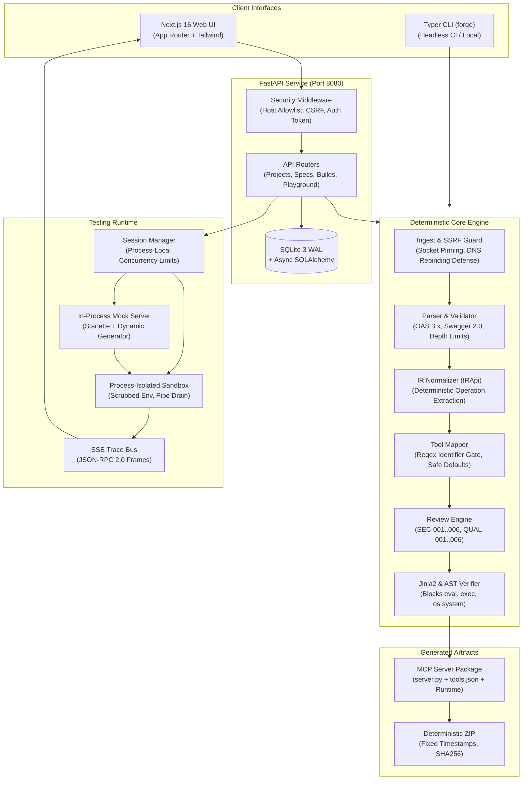
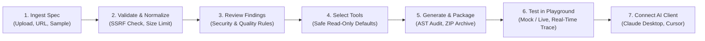

# MCP Server Generator

[](https://github.com/varunahuja70/MCP-Server-Generator/actions)
[](https://python.org)
[](https://fastapi.tiangolo.com)
[](https://nextjs.org)
[](https://www.typescriptlang.org)
[](https://modelcontextprotocol.io)
[](LICENSE)

Turn OpenAPI and Swagger specifications into production-ready Model Context Protocol (MCP) servers with an interactive testing Playground and real-time protocol trace streaming.

MCP Server Generator (`mcp-forge`) is a local-first, security-hardened developer tool that bridges existing REST APIs into the AI agent ecosystem. Both the Next.js web application and the Typer CLI share a single deterministic compilation engine.

---

## Product Overview

The [Model Context Protocol](https://modelcontextprotocol.io) (MCP) provides an open standard for connecting AI applications—such as Claude Desktop, Cursor, and autonomous agent frameworks—to external data sources and tools. Manually writing an MCP server for an enterprise REST API is repetitive and error-prone, requiring schema translation, input validation, rate limiting, and credential handling.

MCP Server Generator automates this transition safely:

- **Ingests any standard specification:** Supports OpenAPI 3.0, 3.1, 3.2, and Swagger 2.0 in JSON or YAML.
- **Deterministic compilation:** Separates API metadata into a verified `tools.json` manifest and pairs it with an audited static runtime engine. It avoids unconstrained LLM code generation for tool dispatch.
- **AST Security Verification:** Every rendered Python file is scanned using Python's Abstract Syntax Tree (`ast.parse`) to guarantee no dynamic execution primitives (`eval`, `exec`, `os.system`, `subprocess`) can slip into generated projects.
- **Safe-by-default access:** All mutating endpoints (`POST`, `PUT`, `DELETE`) are disabled by default. AI agents receive read access only until an authorized engineer explicitly enables writing operations.
- **In-process interactive Playground:** Test generated servers immediately in mock mode (schema-simulated data) or live mode with real-time Server-Sent Events (SSE) JSON-RPC protocol inspection.

---

## Architecture

The system is organized into clean functional layers sharing a single core engine:



### Key Components

- **Core Engine (`backend/src/mcp_forge/core`):** Pure-function pipeline that parses, validates, normalizes, reviews, and renders server code.
- **SSRF Defense (`mcp_forge/core/security/ssrf.py`):** Socket-level network backend that pins verified IP addresses to eliminate DNS rebinding / TOCTOU windows while preserving TLS SNI and certificate validation.
- **Review Engine (`mcp_forge/core/review`):** Static analyzer executing 12 automated checks for security vulnerabilities (unauthenticated mutations, prompt injection patterns, homoglyphs) and quality defects.
- **Playground Subprocess Launcher (`mcp_forge/playground/sandbox.py`):** Spawns isolated server processes with scrubbed environment variables, bounded stderr ring-buffers to prevent OS pipe buffer deadlocks, and process-tree termination.

---

## User Journey Workflow



---

## Implemented Features

### Ingestion & Validation
- [x] Multi-format ingestion: OpenAPI 3.0, 3.1, 3.2, and Swagger 2.0 in JSON or YAML.
- [x] Socket-pinned SSRF protection rejecting loopback, RFC 1918, RFC 6598, link-local, and cloud metadata (`169.254.169.254`) destinations.
- [x] Streaming response body size enforcement (10 MB cap) handling misleading `Content-Length` headers safely.
- [x] Local `$ref` resolution with circular reference cycle breaking and schema depth limits (20 levels).
- [x] Unicode sanitization stripping directional overrides, zero-width characters, and invisible runes.

### Mapping & Code Generation
- [x] Deterministic Intermediate Representation (`IRApi`).
- [x] Identifier normalization guaranteeing tool names match `^[a-z][a-z0-9_]{0,63}$`.
- [x] Safe-by-default selection: `GET` operations enabled; `POST`, `PUT`, `DELETE` disabled until approved.
- [x] Code generation using static runtime architecture: tool logic resides in `tools.json`, executed by an audited runtime client.
- [x] Abstract Syntax Tree (`ast.parse`) inspection rejecting any forbidden calls (`eval`, `exec`, `os.system`, `subprocess`).
- [x] Bit-for-bit reproducible ZIP archive packaging with normalized timestamps.

### Interactive Playground & Protocol Trace
- [x] In-process mock API server synthesizing valid mock payloads from OpenAPI schema definitions.
- [x] Live mode proxying calls to real APIs with credential redaction.
- [x] Real-time protocol trace viewer via Server-Sent Events (SSE) streaming JSON-RPC 2.0 frames.
- [x] Subprocess environment scrubbing protecting host secrets and preventing user overrides of critical runtime variables.
- [x] Non-blocking background stderr draining preventing OS pipe deadlocks.

### Client Connect Snippets
- [x] 1-click configuration generator for **Claude Desktop** (`claude_desktop_config.json`).
- [x] 1-click configuration generator for **Cursor** (`mcp.json`).
- [x] Standard I/O CLI command generation (`uv run python server.py`).
- [x] Streamable HTTP configuration with authentication token enforcement.

---

## Technology Stack

| Layer | Technology | Purpose |
|---|---|---|
| **Frontend** | Next.js 16 (App Router), React 19, Tailwind CSS v4, TanStack Query | Reactive web interface, interactive playground, and real-time trace streaming |
| **Backend API** | FastAPI 0.115+, Uvicorn, Pydantic v2, Typer | High-performance asynchronous REST API and CLI tool |
| **Database & ORM** | SQLite 3 (WAL mode), SQLAlchemy 2.0 (asyncio), Alembic | Local-first relational persistence for projects, spec revisions, and audit findings |
| **Core Parser** | openapi-spec-validator, jsonschema, referencing, PyYAML | Specification validation, schema resolution, and YAML safety |
| **MCP Runtime** | Official Model Context Protocol SDK (`mcp` v2), HTTPX, httpcore | Client-server JSON-RPC communication and socket-pinned HTTP client |
| **Testing & Quality** | Pytest, Hypothesis, Respx, Vitest, Testing Library, Ruff, Mypy (Strict) | Property-based fuzzing, integration testing, static typing, and formatting |
| **Deployment** | Docker (multi-stage builds), Docker Compose, GitHub Actions | Containerized execution and automated CI/CD verification |

---

## Quick Start

### Prerequisites
- **Python:** 3.11+ (Python 3.11, 3.12, 3.13, or 3.14)
- **Node.js:** 22+ with `pnpm` (v9 or v10)
- **Tooling:** [`uv`](https://github.com/astral-sh/uv) (recommended for Python packaging) and `git`

### 1. Clone the Repository
```bash
git clone https://github.com/varunahuja70/MCP-Server-Generator.git
cd MCP-Server-Generator
```

### 2. Start with Make (Recommended)
```bash
make dev
```
This runs the FastAPI backend on `http://127.0.0.1:8080` and the Next.js frontend on `http://127.0.0.1:3000` with hot reloading.

### 3. Alternative: Run in Separate Terminals

#### Terminal 1 — Backend
```bash
cd backend
uv sync --extra dev
uv run uvicorn mcp_forge.api.app:create_app --factory --reload --port 8080
```

#### Terminal 2 — Frontend
```bash
cd frontend
pnpm install --frozen-lockfile
pnpm dev
```

### 4. Verify Local Setup
1. Open **`http://localhost:3000`** in your browser.
2. Select one of the pre-loaded sample specifications (e.g., **Bookshop API** or **Task Management API**).
3. Click **Review API** to inspect security findings and tool selections.
4. Click **Generate Build** to produce a standalone MCP server.
5. Switch to the **Test** tab, start a Playground session, and run any tool to observe live protocol traces.

---

## Configuration Reference

MCP Server Generator is configured via environment variables or a `.env` file in the working directory:

| Variable | Mode | Default | Description |
|---|---|---|---|
| `ENV` | All | `production` | Environment mode (`development` or `production`). |
| `FORGE_MODE` | All | `local` | Operating mode: `local` (loopback only) or `exposed` (requires token). |
| `FORGE_HOST` | All | `127.0.0.1` | Network interface to bind. Non-loopback addresses are rejected in `local` mode. |
| `FORGE_PORT` | All | `8080` | Port for the backend API. |
| `FORGE_PUBLIC_HOST` | Exposed | *None* | Expected hostname for reverse-proxy Host allowlisting. |
| `FORGE_ACCESS_TOKEN` | Exposed | *None* | Secret token required in exposed mode (minimum 16 characters). |
| `FORGE_DATA_DIR` | All | `./data` | Directory for SQLite database (`forge.sqlite3`) and build artifacts. |
| `DATABASE_URL` | All | *Derived* | Async SQLAlchemy connection string (`sqlite+aiosqlite:///data/forge.sqlite3`). |
| `MAX_SPEC_BYTES` | All | `10485760` | Maximum specification upload size in bytes (10 MB). |
| `PIPELINE_TIMEOUT_S` | All | `30` | Maximum wall-clock execution time for parsing and generation pipelines. |
| `PLAYGROUND_ENABLED` | All | `true` (local) | Whether to permit launching interactive playground server processes. |
| `PLAYGROUND_MAX_SESSIONS` | All | `3` | Maximum concurrent active playground sessions. |
| `PLAYGROUND_IDLE_TIMEOUT_S` | All | `900` | Session idle timeout in seconds before automatic cleanup (15 minutes). |
| `TRACE_RETENTION_DAYS` | All | `7` | Retention period for recorded trace events. |
| `ALLOW_PRIVATE_SPEC_URLS` | All | `false` | When true, permits fetching specs from private RFC 1918 subnets (trusted dev only). |
| `LOG_LEVEL` | All | `info` | Structured logging verbosity (`debug`, `info`, `warning`, `error`). |

---

## Usage Walkthrough

### Command Line Interface (`forge`)

The CLI provides headless validation, review, and generation for automated scripts and CI pipelines:

```bash
cd backend

# Validate an OpenAPI specification
uv run forge check samples/bookshop.openapi.yaml

# Run security and quality audit
uv run forge review samples/bookshop.openapi.yaml

# Generate an MCP server with safe read-only defaults
uv run forge generate samples/bookshop.openapi.yaml -o ./dist/bookshop-mcp

# Generate with specific tools enabled and JSON output for CI pipelines
uv run forge generate samples/bookshop.openapi.yaml -o ./dist/bookshop-mcp --select listBooks --json

# Seed bundled sample projects into local database
uv run forge samples --seed
```

### Generated Server Structure

Every generated project is completely self-contained and ready to execute:

```text
bookshop-mcp/
├── runtime/
│   ├── auth.py             # API Key, Bearer Token, and Basic Auth handling
│   ├── client.py           # Resilient HTTP client with retry and timeout policies
│   ├── config.py           # Environment variable settings
│   ├── logging.py          # Structured JSON logging to stderr with redaction
│   ├── rate_limit.py       # Token-bucket rate limiting
│   ├── request_builder.py  # Path, query, and header parameter assembly
│   └── response.py         # Response size limits and error normalization
├── server.py               # Main Model Context Protocol server entry point
├── tools.json              # Canonical schema-validated tools manifest
├── pyproject.toml          # Standalone Python packaging metadata
├── Dockerfile              # Production container build definition
├── .env.example            # Environment configuration template
└── README.md               # Quick-start instructions and client configs
```

### Connecting to Claude Desktop

Add the server to your `claude_desktop_config.json`:

```json
{
  "mcpServers": {
    "bookshop": {
      "command": "uv",
      "args": ["run", "--directory", "/absolute/path/to/bookshop-mcp", "python", "server.py"],
      "env": {
        "API_BASE_URL": "https://api.example.com",
        "API_KEY": "your-api-key-here"
      }
    }
  }
}
```

---

## Project Structure

```text
MCP-Server-Generator/
├── .github/
│   ├── workflows/ci.yml         # CI pipeline (lint, strict types, pytest, vitest, build, audit)
│   ├── workflows/release.yml    # Tagged release wheel and container publication
│   └── dependabot.yml           # Automated dependency update configuration
├── backend/
│   ├── src/mcp_forge/
│   │   ├── api/                 # FastAPI routes, middleware, dependencies, schemas
│   │   ├── cli/                 # Typer CLI application (check, review, generate, serve, samples)
│   │   ├── core/                # Ingest, parser, IR normalizer, tool mapper, review, render
│   │   ├── db/                  # SQLAlchemy models, SQLite WAL session management, Alembic migrations
│   │   ├── mock_api/            # In-process mock API server for Playground testing
│   │   ├── playground/          # Session manager, sandbox launcher, SSE trace bus
│   │   ├── services/            # Build management, deterministic ZIP packaging
│   │   └── templates/           # Jinja2 templates and runtime code for generated servers
│   ├── tests/                   # 190 automated unit, security, integration, and performance tests
│   ├── Dockerfile               # Backend container build definition
│   └── pyproject.toml           # Python packaging configuration and dependency lockfile
├── frontend/
│   ├── src/
│   │   ├── app/                 # Next.js 16 App Router pages (Projects, Review, Builds, Playground)
│   │   ├── components/          # Reusable UI components (Navbar, SchemaForm, CodeViewer, FileTree)
│   │   ├── lib/                 # API client, React Query hooks, query cache management
│   │   ├── styles/              # Tailwind CSS stylesheet and design tokens
│   │   └── test/                # Frontend smoke, component, and schema form unit tests
│   ├── Dockerfile               # Frontend Next.js production build definition
│   └── package.json             # Node.js dependencies and build scripts
├── samples/                     # Bundled OpenAPI 3.0/3.1 and Swagger 2.0 specifications
├── docs/                        # Architecture, PRD, security model, and deployment guides
├── docker-compose.yml           # Production container composition
├── docker-compose.dev.yml       # Development container composition
├── Makefile                     # Unified development and testing commands
├── SECURITY.md                  # Private vulnerability disclosure guidelines
├── CONTRIBUTING.md              # Contributor setup and coding standards
└── LICENSE                      # MIT License
```

---

## Testing & Quality Verification

All changes are verified through strict automated checks across backend and frontend:

### Automated Test Coverage
- **Backend Test Suite:** 190 tests passing (`pytest` with 86% coverage, including 12 dedicated security test suites).
- **Frontend Test Suite:** 7 tests passing (`vitest` with Testing Library).
- **Total:** 197 automated tests executed in local and remote CI pipelines.

### Verification Commands

```bash
# Backend checks
cd backend
uv run ruff check .                      # Lint check
uv run ruff format --check .             # Code format check
uv run mypy src tests                    # Strict type checking (137 source files, 0 errors)
uv run pytest --cov=mcp_forge            # Complete test suite with coverage
uv run pip-audit                         # Dependency vulnerability audit

# Frontend checks
cd frontend
pnpm lint                                # ESLint validation
pnpm tsc --noEmit                        # TypeScript static type check
pnpm test                                # Vitest test execution
pnpm build                               # Next.js production compilation
pnpm audit --prod --audit-level=high     # Production dependency audit
```

---

## Security Model & Limitations

### Security Guarantees
1. **SSRF Socket Pinning:** Outbound requests pre-resolve and validate destination IPs against private/loopback/cloud-metadata ranges and connect directly to the validated IP at the TCP socket layer, completely closing the TOCTOU DNS-rebinding window while preserving TLS SNI and certificate verification.
2. **Deterministic Static Runtime:** Specification text and user inputs are strictly restricted to `tools.json` and runtime request data. No user-supplied text is ever interpolated into Python executable code.
3. **AST Inspection:** Generated Python files undergo Abstract Syntax Tree analysis to confirm no dynamic execution primitives (`eval`, `exec`, `__import__`, `subprocess`, `os.system`) are present.
4. **Environment Variable Scrubbing:** Sandboxed Playground server subprocesses receive only whitelisted OS runtime keys. Host secrets (`FORGE_ACCESS_TOKEN`, `DATABASE_URL`) are omitted, and critical runtime variables cannot be overridden by user input.
5. **Host Header & CSRF Protection:** Local mode restricts execution to loopback interfaces. State-changing requests enforce the custom `X-Forge-Request: 1` header and validate `Origin` and `Host` headers (including bracketed IPv6 representations).

### Known Architectural Limitations
- **Single-Worker Server Architecture:** Playground sessions and active child subprocess references are maintained in process memory. The backend must run as a single process (`1 uvicorn worker`). Multi-worker deployments (e.g., `uvicorn -w 4`) are not supported for interactive playground sessions without an external process supervisor.
- **Process Isolation Boundary:** The Playground Sandbox utilizes OS process-group management, scrubbed environment variables, and bounded I/O pipes. It provides process-level isolation rather than hypervisor or container virtualization. In multi-tenant environments, run MCP Server Generator inside container boundaries with non-root privileges.
- **Remote `$ref` Resolution:** Resolving `$ref` targets across remote HTTP endpoints is disabled by default (`ALLOW_REMOTE_REFS=false`) to prevent blind server-side requests and supply-chain vulnerabilities.

### Vulnerability Reporting
Please report security vulnerabilities privately via [GitHub Security Advisories](https://github.com/varunahuja70/MCP-Server-Generator/security/advisories/new). We acknowledge valid reports within 48 hours.

---

## Roadmap

- [ ] Support OAuth2 Authorization Code flow within the interactive Playground.
- [ ] Containerized runner option (Docker / Podman) for untrusted multi-tenant playground executions.
- [ ] Direct export to cloud serverless targets (AWS Lambda, Cloud Run).
- [ ] Interactive parameter mocking rules editor in web UI.

---

## Contributing

We welcome contributions! Please review [CONTRIBUTING.md](CONTRIBUTING.md) for local workspace setup, code standards, and branch conventions. All submissions are governed by the [Contributor Covenant Code of Conduct](CODE_OF_CONDUCT.md).

---

## License

This project is licensed under the **MIT License** — see the [LICENSE](LICENSE) file for details.
