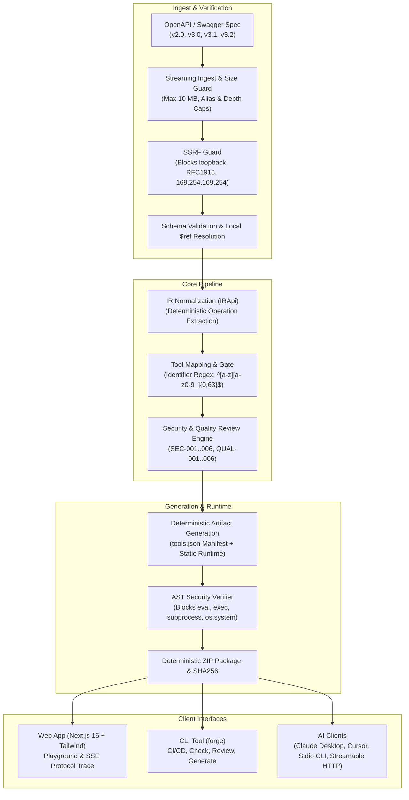

# MCP Forge

[](https://github.com/varunahuja70/MCP-Server-Generator/actions)
[](https://modelcontextprotocol.io/specification/2026-07-28)
[](https://python.org)
[](https://nextjs.org)
[](LICENSE)

**Turn any OpenAPI or Swagger specification into a ready-to-run Model Context Protocol (MCP) server, with an interactive testing Playground and real-time protocol trace.**

Self-hosted, deterministic, local-first, and secure by design. Both the Next.js web application and the Typer CLI (`forge`) share a single core engine.

---

## 1. Project Overview

MCP Forge is a developer tool that bridges existing REST APIs into the AI agent ecosystem. By ingesting OpenAPI 2.0 (Swagger), 3.0, 3.1, and 3.2 specifications, Forge generates fully-functional MCP servers that AI applications (such as Claude Desktop, Cursor, and custom agentic frameworks) can immediately connect to and invoke as standard tools.

---

## 2. Why MCP Forge

1. **Deterministic & Isolated Architecture:** Rather than using unconstrained LLMs or string concatenation to generate arbitrary Python code from untrusted specifications, MCP Forge strictly separates spec metadata into a validated `tools.json` manifest and pairs it with a battle-tested, pre-audited static runtime engine.
2. **AST Security Verification:** Every rendered Python file is analyzed with Python's Abstract Syntax Tree (`ast.parse`) to guarantee no dynamic execution primitives (`eval`, `exec`, `os.system`, `subprocess`) can slip into generated projects.
3. **Safe-by-Default Operation:** Mutating and destructive operations (`POST`, `PUT`, `DELETE`) are disabled by default. AI agents only receive read access until an authorized engineer explicitly enables writing tools.
4. **Built-in Mocking & Playground:** Test your MCP server tools immediately with zero manual configuration. Spawns an in-process MCP server with SSE-streamed JSON-RPC protocol messages and simulated responses.

---

## 3. Architecture Diagram



---

## 4. Request / Generation Lifecycle

1. **Ingestion:** Specifications are loaded via upload, pasted text, or remote URL with streaming size caps (10 MB). Remote URLs undergo strict IP pre-resolution and hop-by-hop redirect validation against loopback, private RFC1918, carrier-grade NAT, and cloud metadata addresses (`169.254.169.254`).
2. **Parsing & Detection:** Format detection identifies Swagger 2.0 or OpenAPI 3.x. Schema validation verifies official specification standards. References (`$ref`) are resolved locally with cycle detection and depth cutoffs.
3. **IR Normalization:** Specification paths and methods are normalized into a unified intermediate representation (`IRApi`). Hidden, invisible, and bidirectional Unicode characters are stripped.
4. **Tool Mapping:** Endpoints are mapped to MCP tool candidates. Tool names are normalized and validated against `^[a-z][a-z0-9_]{0,63}$`. Default selection rules enable read-only (`GET`) endpoints and disable mutating endpoints.
5. **Security & Quality Audit:** Automated audit rules run across the spec, checking for unauthenticated mutating endpoints (`SEC-003`), prompt-like instructions in descriptions (`SEC-002`), missing parameter descriptions (`QUAL-001`), and schema ambiguities.
6. **Artifact Generation:** Jinja2 renders a deterministic `tools.json` manifest alongside static runtime files (`server.py`, `runtime/client.py`, `runtime/auth.py`, `pyproject.toml`, Dockerfile, tests).
7. **AST Audit & Packaging:** Python AST inspection ensures no unapproved system calls exist in rendered Python files. Artifacts are bundled into a bit-for-bit reproducible ZIP archive with fixed 2026-01-01 timestamps.

---

## 5. Key Features

- **Full Multi-Format Support:** Ingests Swagger 2.0, OpenAPI 3.0, 3.1, and 3.2 in JSON or YAML.
- **Dual Interface Parity:** Feature parity between the interactive Next.js web application and the Typer CLI (`forge`).
- **Interactive Playground:** Run MCP servers in mock mode (simulated data) or live mode with real-time SSE protocol trace streaming.
- **Client Connect Snippets:** 1-click JSON configurations for Claude Desktop (`claude_desktop_config.json`), Cursor (`mcp.json`), Stdio CLI, and Streamable HTTP.
- **Security Audit Engine:** Pre-flight review with severity grading (error, warning, info) and human acknowledgement workflows.
- **Spec Versioning & Diffing:** Track spec versions within projects and view semantic diffs across API revisions.
- **Deterministic Packaging:** Guaranteed reproducible builds and SHA256 checksums.

---

## 6. Security Model: The 12 Foundational Guarantees

MCP Forge enforces 12 audited security guarantees across parsing, mapping, and execution:

| # | Security Guarantee | Implementation & Verification |
|---|---|---|
| **1** | **Hostile-Name Fuzz Gate** | Specification text is never concatenated or formatted into Python code; all text resides exclusively in `tools.json`. Verified via property-based hypothesis fuzzing (`test_security_01_hostile_name_fuzz.py`). |
| **2** | **Identifier Regex Validation** | All module names, tool names, and dictionary keys must strictly match `^[a-z][a-z0-9_]{0,63}$`. Invalid characters are renamed or rejected, never escaped (`test_security_02_identifiers.py`). |
| **3** | **AST Security Scanner** | Every generated `.py` file is parsed with `ast.parse`. Build generation immediately fails if calls to `eval`, `exec`, `os.system`, `subprocess`, or dynamic `__import__` are found (`test_security_03_ast_forbidden_calls.py`). |
| **4** | **Resource & Bomb Protection** | Enforces streaming size caps (10 MB), YAML alias caps (max 100 aliases), schema nesting depth limits (20 levels), and circular reference cycle cuts (`test_security_04_hostile_specs.py`). |
| **5** | **Strict SSRF Guard** | Pre-resolves IP addresses and blocks loopback, private subnets (RFC 1918), carrier-grade NAT, IPv6 unique-local, and cloud metadata (`169.254.169.254`). Re-validates every redirect hop (`test_security_05_ssrf.py`). |
| **6** | **Unicode Sanitation & Instruction Scans** | Strips invisible/bidi Unicode characters, normalizes Unicode using NFKC, flags homoglyphs (`SEC-001`), and scans tool descriptions for prompt-injection patterns (`SEC-002`) (`test_security_06_unicode.py`). |
| **7** | **Zero-Leak Credential Redaction** | Passwords, tokens, and API keys are scrubbed immediately from frontend memory, filtered through structlog redaction, and never written to SQLite, logs, or URL parameters (`test_security_07_redaction.py`). |
| **8** | **Isolated Playground Sandbox** | Sandboxes run with scrubbed environment variables, isolated temporary directories, process-group termination, and strict concurrency limits (`test_security_08_playground.py`). |
| **9** | **Path Traversal Containment** | File tree browsing and archive downloads strictly verify canonical paths against the project root, blocking relative `..` and absolute traversal escapes (`test_security_09_paths.py`). |
| **10** | **Host Allowlisting & Token Requirement** | Local mode binds exclusively to loopback interfaces. Exposed mode refuses to start without a secure `FORGE_ACCESS_TOKEN` (minimum 16 characters) (`test_security_10_local.py`). |
| **11** | **Streamable HTTP Non-Loopback Enforcement** | Generated servers running HTTP transport refuse to bind to non-loopback addresses (`0.0.0.0`) unless `MCP_AUTH_TOKEN` is configured (`test_generated_project.py`). |
| **12** | **Safe-by-Default Tool Selection** | All mutating (`POST`, `PUT`) and destructive (`DELETE`) operations are strictly disabled by default; only safe read-only (`GET`) tools are enabled initially (`test_security_12_default_selection.py`). |

---

## 7. Requirements

- **Python:** Python 3.11+ (Python 3.11, 3.12, 3.13, or 3.14 supported; Python 3.13 tested in CI)
- **Node.js:** Node.js 22+ with `pnpm` (v9 or v10)
- **Package Manager:** [`uv`](https://github.com/astral-sh/uv) for fast Python dependency management
- **Operating System:** Linux, macOS, or Windows (native or WSL)

---

## 8. Quick Start

### 1. Clone the Repository
```bash
git clone https://github.com/varunahuja70/MCP-Server-Generator.git
cd MCP-Server-Generator
```

### 2. Run with Make (Development Mode)
```bash
# Starts FastAPI backend (port 8080) and Next.js frontend (port 3000)
make dev
```

Alternatively, run backend and frontend in separate terminals:

```bash
# Terminal 1: Backend
cd backend
uv sync --extra dev
uv run uvicorn mcp_forge.api.app:create_app --factory --reload --port 8080

# Terminal 2: Frontend
cd frontend
pnpm install --frozen-lockfile
pnpm dev
```

### 3. Open the Web Application
1. Navigate to **`http://localhost:3000`** in your browser.
2. Select one of the pre-loaded sample APIs (e.g. **Task Management API** or **Bookshop API**).
3. Review your tools and click **Generate Build**.
4. Open the **Test** tab (Playground), click **Start Session**, select any tool, and run it to view live protocol traces!

---

## 9. Command Line Interface (`forge`)

MCP Forge includes a command line interface for CI/CD automation pipelines and local terminal workflows:

```bash
cd backend
uv sync --extra dev

# 1. Validate an OpenAPI or Swagger file
uv run forge check samples/bookshop.openapi.yaml

# 2. Run security and quality rules review
uv run forge review samples/bookshop.openapi.yaml

# 3. Generate an MCP server project with safe defaults (read-only tools enabled)
uv run forge generate samples/bookshop.openapi.yaml -o ./out/bookshop-server

# 4. Generate with explicit tool selection and JSON output for CI pipelines
uv run forge generate samples/bookshop.openapi.yaml -o ./out/bookshop-server --select listBooks --json

# 5. List or seed bundled sample projects into local database
uv run forge samples
uv run forge samples --seed

# 6. Start the FastAPI backend server via CLI
uv run forge serve --host 127.0.0.1 --port 8080

# 7. Wipe all stored local database projects and build files
uv run forge wipe --yes
```

### CLI Exit Codes
- `0`: Success / valid specification / review passed with no blocking errors.
- `1`: Invalid specification / blocking security finding / generation failure.
- `2`: Command usage error, missing arguments, or invalid options.

---

## 10. Configuration Reference

MCP Forge is configured via environment variables or a `.env` file located in the working directory:

| Environment Variable | Default | Mode | Description |
|---|---|---|---|
| `ENV` | `production` | All | Runtime environment: `development` or `production`. |
| `FORGE_MODE` | `local` | All | Operating mode: `local` (loopback only) or `exposed` (requires token). |
| `FORGE_HOST` | `127.0.0.1` | All | Network interface to bind. Prohibited from non-loopback in local mode. |
| `FORGE_PORT` | `8080` | All | Port to listen on (default 8080). |
| `FORGE_PUBLIC_HOST` | *None* | Exposed | Hostname for reverse-proxy Host allowlisting. |
| `FORGE_ACCESS_TOKEN` | *None* | Required in Exposed | Bearer token required in exposed mode (minimum 16 characters). |
| `FORGE_DATA_DIR` | `./data` | All | Directory for SQLite database (`forge.sqlite3`) and build artifacts. |
| `DATABASE_URL` | *Derived* | All | Async SQLAlchemy connection string (default: `sqlite+aiosqlite:///data/forge.sqlite3`). |
| `MAX_SPEC_BYTES` | `10485760` | All | Maximum specification upload size in bytes (default 10 MB). |
| `PIPELINE_TIMEOUT_S` | `30` | All | Maximum wall-clock execution time for parsing/generation pipelines. |
| `PLAYGROUND_ENABLED` | `true` in local, `false` in exposed | All | Whether to permit spawning interactive playground server processes. |
| `PLAYGROUND_MAX_SESSIONS` | `3` | All | Maximum concurrent active playground sessions. |
| `PLAYGROUND_IDLE_TIMEOUT_S` | `900` | All | Maximum idle time before auto-terminating a playground session (15 min). |
| `TRACE_RETENTION_DAYS` | `7` | All | Days to retain playground trace events before purge. |
| `ALLOW_PRIVATE_SPEC_URLS` | `false` | All | When true, permits fetching specs from private RFC1918 addresses. |
| `ALLOW_REMOTE_REFS` | `false` | All | When true, permits fetching remote JSON/YAML `$ref` references over HTTP. |
| `LOG_LEVEL` | `info` | All | Logging level: `debug`, `info`, `warning`, `error`. |

---

## 11. Generated Server Usage

Every generated MCP server includes a standalone project structure:

```text
generated-server/
├── runtime/
│   ├── auth.py             # Header, bearer token, API key handling
│   ├── client.py           # Resilient HTTP client with timeouts & retries
│   ├── config.py           # Settings loaded from environment variables
│   ├── logging.py          # Structured JSON logging to stderr with redaction
│   ├── rate_limit.py       # Token bucket rate limiting
│   ├── request_builder.py  # Path/query/body parameter assembly
│   └── response.py         # Response truncation and error formatting
├── server.py               # Main MCP Server entry point (FastMCP v2)
├── tools.json              # Canonical schema-validated tools manifest
├── pyproject.toml          # Standalone Python packaging metadata
├── Dockerfile              # Container deployment recipe
├── .env.example            # Environment variables template
└── README.md               # Ready-to-copy client connection instructions
```

### Running the Generated Server

```bash
cd generated-server

# 1. Install dependencies
uv sync

# 2. Run over standard I/O (Default for Claude Desktop and Cursor)
uv run python server.py

# 3. Run over Streamable HTTP transport
uv run python server.py --http --port 8000
```

### Claude Desktop Configuration
Add the following to your `claude_desktop_config.json`:
```json
{
  "mcpServers": {
    "my-api": {
      "command": "uv",
      "args": ["run", "--directory", "/path/to/generated-server", "python", "server.py"],
      "env": {
        "API_KEY": "your-api-key-here"
      }
    }
  }
}
```

---

## 12. Interactive Playground

The built-in Playground allows developers to test MCP tools immediately without external clients:
- **Mock Mode:** Synthesizes realistic responses from OpenAPI response schemas entirely in-process. Safe for destructive operations.
- **Live Mode:** Dispatches real HTTP requests to remote endpoints with user-entered credentials. Non-read-only operations prompt for confirmation.
- **Protocol Trace:** Real-time Server-Sent Events (SSE) trace viewer displays exact JSON-RPC 2.0 frames (`tools/list`, `tools/call`, responses, and durations).
- **Process Isolation:** Sessions are executed in isolated subprocesses with automatic resource cleanup upon disconnect or idle timeout.

---

## 13. REST API Overview

The backend exposes a full OpenAPI-compliant REST API:

- `GET /healthz` — Service liveness probe.
- `GET /readyz` — Database and storage readiness probe.
- `GET /api/projects` — List all projects.
- `POST /api/projects` — Create a new project.
- `GET /api/projects/{id}` — Retrieve project metadata and spec versions.
- `POST /api/projects/{id}/specs` — Ingest a new specification version.
- `GET /api/projects/{id}/operations` — List parsed operations and tool configuration.
- `POST /api/projects/{id}/review` — Run automated security and quality audit.
- `POST /api/projects/{id}/builds` — Generate a new MCP server build.
- `GET /api/builds/{id}/files` — Inspect generated file tree.
- `GET /api/builds/{id}/files/content` — Read generated file source code.
- `GET /api/builds/{id}/download` — Download deterministic ZIP archive.
- `POST /api/playground/sessions` — Start an in-process playground session.
- `GET /api/playground/sessions/{id}/tools` — List tools from running MCP server.
- `POST /api/playground/sessions/{id}/call` — Invoke a tool on running MCP server.
- `GET /api/playground/sessions/{id}/trace` — Stream SSE protocol messages.

---

## 14. Development & Testing

### Available Make Targets
```bash
make help           # View command summary
make dev            # Run backend and frontend concurrently
make test           # Run complete backend and frontend test suites
make test-backend   # Run backend pytest suite
make test-frontend  # Run frontend vitest suite
make lint           # Run all linting and typechecking
make lint-backend   # Run ruff check, ruff format, and mypy
make lint-frontend  # Run eslint and tsc --noEmit
make migrate        # Run Alembic database migrations
make seed           # Seed sample specifications into local database
make build          # Build backend distribution wheel and frontend static bundle
```

### Running Backend Tests & Audit
```bash
cd backend
uv sync --extra dev
uv run ruff check .
uv run ruff format --check .
uv run mypy src tests
uv run pytest
uv run pip-audit
```

### Running Frontend Tests & Audit
```bash
cd frontend
pnpm install --frozen-lockfile
pnpm lint
pnpm tsc --noEmit
pnpm test
pnpm build
pnpm audit --audit-level=high
```

---

## 15. Project Structure

```text
MCP-Server-Generator/
├── .github/
│   ├── workflows/ci.yml       # Automated CI (lint, types, tests, pip-audit, npm-audit, gitleaks)
│   └── dependabot.yml         # Dependency update schedule
├── backend/
│   ├── src/mcp_forge/
│   │   ├── api/               # FastAPI application, routes, dependencies, schemas
│   │   ├── cli/               # Typer CLI application (check, review, generate, serve, samples, wipe)
│   │   ├── core/              # Ingest, parsing, IR normalization, tool mapping, review engine, render
│   │   ├── db/                # SQLAlchemy async models, migrations, SQLite WAL session management
│   │   ├── playground/        # In-process session manager, sandbox launcher, SSE trace bus
│   │   └── services/          # Build orchestration, deterministic packaging
│   ├── tests/                 # 175 unit, security, integration, and performance tests
│   └── pyproject.toml         # Python package metadata and tool configurations
├── frontend/
│   ├── src/
│   │   ├── app/               # Next.js 16 app router pages (Home, Projects, Playground, Guide)
│   │   ├── components/        # UI components (SchemaForm, CodeViewer, FileTree, Navbar)
│   │   ├── lib/               # API client, React Query hooks
│   │   └── styles/            # Tailwind CSS styling and theme tokens
│   └── package.json           # Frontend dependencies and build scripts
├── samples/                   # Bundled OpenAPI & Swagger test specifications
├── docs/                      # Architectural specifications and engineering design docs
├── .env.example               # Environment configuration template
├── docker-compose.yml         # Containerized production stack
├── Makefile                   # Unified developer automation commands
├── LICENSE                    # MIT License
├── SECURITY.md                # Vulnerability disclosure policy
└── README.md                  # This documentation
```

---

## 16. Limitations

- **Single-Tenant / Local-First:** Designed for individual developers or internal engineering teams. Forge uses SQLite with WAL mode rather than multi-tenant cloud tenancy.
- **Deterministic Static Runtime:** Tool calls are dispatched through an audited, fixed static runtime library rather than generating distinct Python source functions per endpoint.
- **Remote `$ref` Disabled by Default:** Ingestion rejects remote `$ref` resolution over HTTP by default to protect against SSRF and supply-chain poisoning.
- **Heuristic Instruction Detection:** `SEC-002` flags adversarial prompt injection patterns in descriptions using heuristic regexes; human review remains essential before publishing tools.

---

## 17. Contributing

Contributions are welcome! Please read [CONTRIBUTING.md](CONTRIBUTING.md) and [CODE_OF_CONDUCT.md](CODE_OF_CONDUCT.md) for contribution guidelines, development workflows, and testing requirements.

---

## 18. License

This project is licensed under the MIT License — see the [LICENSE](LICENSE) file for details.
